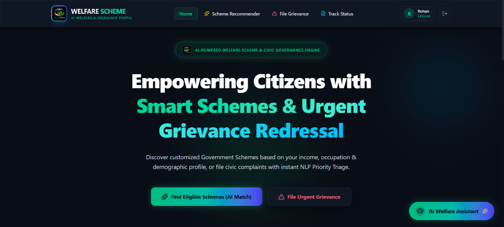
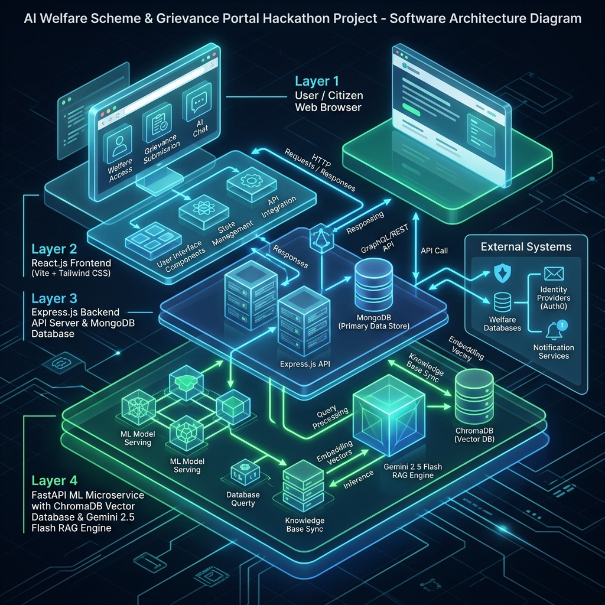

# SUVIDHA 2.0 - Welfare Access & Grievance Redressal System

An AI-powered, full-stack digital governance platform designed to bridge the gap between citizens and government welfare schemes while streamlining the civic grievance redressal process. SUVIDHA 2.0 leverages modern web technologies, machine learning classifiers, and Retrieval-Augmented Generation (RAG) to provide a seamless, transparent, and responsive experience for citizens and administrators.

---

## 🚀 Project Overview

SUVIDHA (Welfare Access & Grievance Redressal System) addresses two critical governance challenges:
1. **Welfare Discovery Gap:** Many eligible citizens miss out on welfare benefits due to the complexity of navigating thousands of central and state schemes.
2. **Grievance Redressal Friction:** Submitting civic complaints and routing them to the correct department with appropriate priority is often slow, manual, and error-prone.

SUVIDHA 2.0 provides an **AI-driven scheme matching engine**, a **natural language semantic search tool (RAG)**, an **interactive chatbot**, and a **smart NLP grievance classifier** to automatically categorize, prioritize, and route citizen complaints to municipal officers.

---

## 📸 Screenshots & Diagrams

### SUVIDHA Citizen Portal Homepage


### System Architecture


---

## ✨ Key Features

### 1. AI-Powered Welfare Scheme Recommendation
* **Demographic Profiling:** Users build a personal profile including State, District, Age, Gender, Income, Caste Category, Occupation, Education, and Student Status.
* **Deterministic Hard Eligibility Filtering:** Computes instant matches across 3,400+ welfare schemes based on official department rules.
* **Explainable Matching (SUVIDHA Match Score):** Renders transparent reasons detailing why a user is eligible or ineligible for a specific scheme.

### 2. RAG-Powered Semantic Search & Chatbot
* **Natural Language Queries:** Search for welfare benefits using plain queries in English or Hindi (e.g., *"scholarships for female college students in West Bengal"*).
* **Retrieval-Augmented Generation (RAG):** The system indexes schemes in a ChromaDB vector store. When queried, it retrieves the most relevant schemes and uses the Google Gemini API to construct accurate, context-aware answers.
* **Verified Citations:** Responses cite verified sources and link to official portals, preventing hallucinations.

### 3. Smart Grievance Redressal System
* **Automated NLP Classification:** Uses machine learning models and rule-based keyword matchers to classify citizen complaints into categories (e.g., Electricity, Water Supply, Road Infrastructure, Sanitation).
* **Urgency & Priority Scoring:** Analyzes text for safety hazards (e.g., "sparking transformer", "drainage overflow") to dynamically set priority levels (`CRITICAL`, `HIGH`, `MEDIUM`, `LOW`) and generate SLA targets.
* **Intelligent Routing:** Automatically assigns grievances to the respective municipal department (e.g., PWD, Electricity Board) with detailed routing reasons.

### 4. Officer & Admin Dashboards
* **Real-time Database Metrics:** Overview of total users, registered schemes, active vs. resolved grievances, and average resolution times.
* **Feedback Tracking:** Monitor citizen satisfaction rates based on helpfulness feedback.
* **Grievance Triage:** Officers can update statuses (e.g., `UNDER_REVIEW`, `IN_PROGRESS`, `RESOLVED`), upload attachments, and track history.

### 5. Multi-Language & Dual-Theme Support
* **Full English & Hindi Localizations:** Toggle languages dynamically with instant UI translation.
* **Premium UI Aesthetics:** Adaptive Dark and Light themes using Tailwind CSS with glassmorphic cards and micro-animations.

---

## 🛠️ Tech Stack

### Frontend
* **Core:** React.js (Vite)
* **Styling:** Tailwind CSS (Modern, dark-mode first design)
* **Icons:** Lucide React
* **State Management:** Context API (Theme, Language, Auth) & Redux Toolkit
* **API Client:** Axios

### Backend
* **Runtime:** Node.js (Express.js)
* **Database:** MongoDB Atlas (Mongoose ODM)
* **Security:** JWT Auth with cookie-parser, Express Rate Limiter, and CORS validation
* **File Uploads:** Multer (local disk storage)

### ML & AI Microservice
* **Framework:** Python FastAPI (Uvicorn server)
* **Vector Database:** ChromaDB
* **LLM Engine:** Google Gemini API (`text-embedding-004` & `gemini-1.5-flash`)
* **Data Processing:** Pandas, Pydantic, python-dotenv
* **Classification:** Scikit-learn (eligibility and priority predictors)

---

## 📂 Project Structure

```text
SUVIDHA/
├── backend/                  # Node.js Express server
│   ├── config/               # Database connection config
│   ├── controllers/          # Business logic handlers (Auth, Grievances, Schemes)
│   ├── middleware/           # JWT authentication, roles authorization, rate limiters
│   ├── models/               # MongoDB schema models (User, Scheme, Grievance, etc.)
│   ├── routes/               # REST API Router endpoints
│   ├── scripts/              # Data seeding and migration scripts
│   ├── uploads/              # Stored citizen grievance attachments
│   └── server.js             # Express application root
│
├── frontend/                 # React client application (Vite + Tailwind CSS)
│   ├── public/               # Static assets & favicons
│   └── src/
│       ├── assets/           # Images and logos
│       ├── components/       # Reusable components (Navbar, Chatbot, Maps, etc.)
│       ├── context/          # Theme, Language, and Auth Context providers
│       ├── pages/            # View pages (Home, Finder, Dashboard, Portal)
│       ├── redux/            # Redux store slices (auth, complaints, schemes)
│       └── services/         # Axios API clients
│
├── ml_service/               # Python AI/ML microservice
│   ├── data/                 # Raw datasets and scheme definitions
│   ├── ingestion/            # ChromaDB ingestion pipeline (PDF, CSV, JSON)
│   ├── prediction/           # Models for eligibility, priority, and chatbot
│   ├── preprocessing/        # Dataset cleaning and processing scripts
│   ├── rag/                  # RAG retrieval and response generation
│   ├── api.py / main.py      # FastAPI entry points
│   └── train_models.py       # ML classifier training script
│
├── docs/                     # Documentation and media
│   └── assets/               # Architecture diagrams and portal screenshots
│
├── start_suvidha.bat         # Windows single-click launcher script
└── package.json              # Main workspace script runner
```

---

## ⚙️ Getting Started (Local Setup)

### Prerequisites
* **Node.js** (v16+)
* **Python** (v3.10+)
* **MongoDB** (Local Community Server or Atlas Cloud instance)
* **Google Gemini API Key** (Required for the AI RAG Chatbot)

---

### 1. Configure Environment Variables
Copy `.env.example` in the project root to create individual `.env` files:

#### For Express Backend (`backend/.env`):
```env
PORT=5000
MONGODB_URI=mongodb+srv://<username>:<password>@cluster.mongodb.net/suvidha?retryWrites=true&w=majority
JWT_SECRET=suvidha_secret_key_2026_super_secure
ML_SERVICE_URL=http://localhost:8000
FRONTEND_URL=http://localhost:3000
```

#### For ML Service (`ml_service/.env`):
```env
PORT=8000
GEMINI_API_KEY=your_google_gemini_api_key_here
FRONTEND_URL=http://localhost:3000
CHROMA_DB_DIR=chroma_db
```

---

### 2. Install Dependencies & Set Up Services

#### Backend Setup:
```bash
cd backend
npm install
# Seed the database with 3,400+ welfare schemes
node seed_all_schemes.js
```

#### ML Microservice Setup:
```bash
cd ml_service
# Create a python virtual environment
python -m venv venv
source venv/bin/activate  # On Windows: venv\Scripts\activate
pip install -r requirements.txt
# Run the ChromaDB vector database ingestion pipeline
python ingestion/ingest.py
```

#### Frontend Setup:
```bash
cd frontend
npm install
```

---

### 3. Running SUVIDHA 2.0

#### Option A: Quick-Launch on Windows
Run the automated launcher batch script in the root directory:
```bash
.\start_suvidha.bat
```
This script will seed the database, launch the FastAPI ML microservice, start the Express backend, and spin up the React frontend in separate command windows.

#### Option B: Launch Manually (Multi-Platform)
Open three terminal windows to run each service:

* **FastAPI ML Microservice:**
  ```bash
  cd ml_service
  python -m uvicorn api:app --host 127.0.0.1 --port 8000
  ```
* **Express Backend Server:**
  ```bash
  cd backend
  node server.js
  ```
* **React Frontend Client:**
  ```bash
  cd frontend
  npm run dev
  ```

Once all services are running, open your browser and navigate to: **[http://localhost:3000](http://localhost:3000)**.

---

## 🔌 API Endpoints Summary

### Express API Gateway (Port 5000)

| Method | Endpoint | Description | Auth Required |
| :--- | :--- | :--- | :---: |
| `POST` | `/api/auth/register` | Register new user | No |
| `POST` | `/api/auth/login` | Login user & issue JWT | No |
| `GET` | `/api/schemes` | Retrieve all schemes (with pagination) | Yes |
| `GET` | `/api/grievances` | List logged user grievances | Yes |
| `POST` | `/api/grievances` | File a new grievance (supports attachments) | Yes |
| `GET` | `/api/admin/analytics` | Fetch metrics and KPIs for dashboard | Yes (Admin/Officer) |
| `PATCH` | `/api/grievances/:id` | Update grievance status / assign officer | Yes (Admin/Officer) |

### FastAPI ML Microservice (Port 8000)

| Method | Endpoint | Description | Key Params |
| :--- | :--- | :--- | :--- |
| `POST` | `/predict-eligibility` | Evaluates schemes against user profile | `userProfile`, `schemes` |
| `POST` | `/analyze-complaint` | Classifies category, priority, and department | `title`, `description` |
| `POST` | `/chat` | Chatbot answering with Chroma RAG references | `message`, `userProfile` |
| `POST` | `/ingest-csv` | Dynamically uploads & ingests a CSV to ChromaDB | `file` (Multipart) |
| `GET` | `/api/chatbot/health` | Diagnostic of ChromaDB & Gemini key config | None |

---

## 🤝 Contributing
Contributions are welcome! Please feel free to open a Pull Request or report issues.

## 📄 License
This project is licensed under the MIT License.
